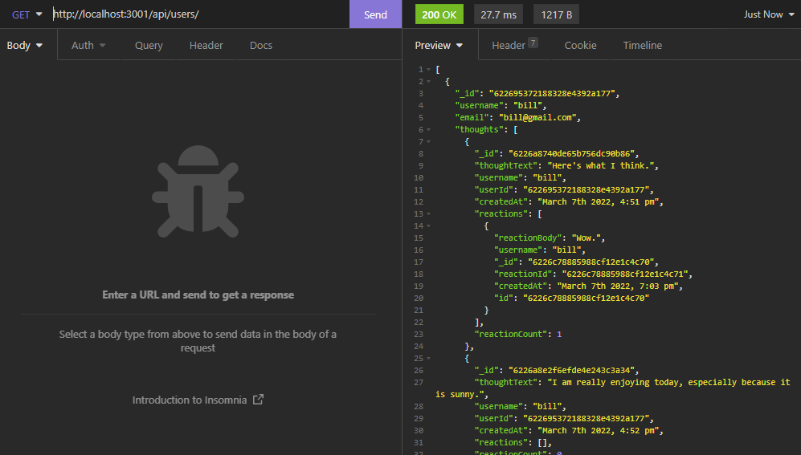

# Your-Thoughts-Social-Media

## Description
An API for a social network site that allows a user to post "thoughts", add friends, and react to the thoughts of others. The backend runs on MongoDB NoSQL database, and Mongoose. 

## Made With
NoSQL, MongoDB, Mongoose, JavaScript, Node.js, Express.js, Moment.js, Validator.js

## Demo Video Link
https://www.youtube.com/watch?v=tk3oDR1s4Pc
